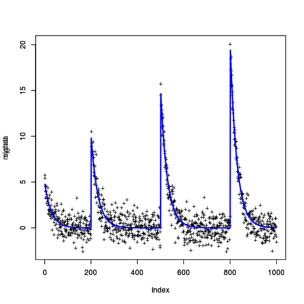

<a id="top"></a>

[](https://travis-ci.com/vrunge/gfpop)
[](https://github.com/vrunge/gfpop)

<!-- 
%\VignetteEngine{knitr::rmarkdown} 
%\VignetteIndexEntry{An Introduction to gfpop}
--> 

# gfpop Vignette
### Vincent Runge
#### LaMME, Evry University
### February 20, 2019

> [Introduction](#intro)

> [Quick Start](#qs)

> [Some examples](#se)

> [Graph construction](#gc)

<a id="intro"></a>

## Introduction

`gfpop` is an `R` package developed to perform parametric changepoint detection in univariate time series constrained to a graph structure. The constraints are imposed to the sequence of infered means of consecutive segments and are related to the direction and/or the magnitude of the mean changes. Changepoint detection is performed using the functional pruning optimal partitioning method (fpop) based on an exact dynamic programming algorithm.  The user can specify some other constraints on the graph (starting and ending vertices) and constraint the range of means. 

For each data point, the algorithm updates a function (a functional cost) and we go through an edge. The edges of the graph can be of type "null", up", "down", "std", "absInf" or "absSup" with the following meaning:

- "null" edge : there is no changepoint introduced. We stay on the same segment (if its parameter < 1 there is an exponetional decay with gamma = parameter)
- "up" edge : the next segment has a greater mean (we can also force the size of the gap to be greater than a minimal value)
- "down" edge : the next segment has a lower mean (wan also can force the size of the gap to be greater that a minimal value)
- "std" edge : no contraint, the next segment can have any mean
- "absSup" edge : the absolute value of the difference of two consecutive means is greater than a given parameter
- "absInf" edge : the absolute value of the difference of two consecutive means is lower than a given parameter

A nonnegative internal parameter can thus be associated to an edge (in "up" and "down") or is mandatory ("absSup" and "absInf"). The "null" edge refers to an absence of changepoint. This edge can be used between different states to constraint segment lengths. Our package includes the segment neighborhood algorithm for which the number of changepoints is fixed. More details on graph construction are given in the last [section](#gc).

Data is modelized by a quadratic cost with possible use of a robust loss, biweight and Huber. In a next version of this package, other parametric costs will be available (L1, Poisson). 

The package `gfpop` is designed to segment univariate data $y_{1:n} = \{y_1,...,y_n\}$ obeying to a graph structure on segment means. The changepoint vector $\overline{\tau} = (\tau_0 < \cdots < \tau_{k+1}) \in \mathbb{N}^{k+2}$ defines the $k+1$ segments $\{\tau_i+1,...,\tau_{i+1}\}$, $i = 0,...,k$ with fixed bounds $\tau_0 = 0$ and  $\tau_{k+1} = n$. We use the set $S_n = \{\hbox{changepoint vector } \overline{\tau} \in \mathbb{N}^{k+2}\}$ to define the nonconstrained minimal global cost given by

$$Q_n = \min_{\overline{\tau} \in S_n}\left[ \sum_{i=0}^{k}\lbrace \mathcal{C}(y_{(\tau_i+1):\tau_{i+1}}) + \beta \rbrace \right]\,,$$

where $\beta > 0$ is a penalty parameter and $\mathcal{C}(y_{u:v})$ is the minimal cost over the segment $\{u,...,v\}$. The penalty $\beta$ is understood as an additional cost when introducing a new segment. The argminimum of this quantity gives a vector $\tau^*$ containing the last position of each segment (if we do not consider $\tau_0 = 0$). The quantity $Q_n$ is the solution of the nonconstrained optimal partitioning method. 

In our setting, the cost $\mathcal{C}$ is the result of the minimization of a cost function with additive property:

$$ \left\{
\begin{array}{l}
  \mathcal{C}(y_{(\tau_i+1):\tau_{i+1}}) = \min_{\theta_i}\mathcal{C}(y_{(\tau_i+1):\tau_{i+1}}, \theta_i) = \min_{\theta_i} \sum_{j = \tau_i+1}^{\tau_{i+1}}\gamma(y_j, \theta_i)\,,\\
  m_i = \mathrm{argmin}_{\theta_i}\mathcal{C}(y_{(\tau_i+1):\tau_{i+1}}, \theta_i)\,,
\end{array}
\right.$$

with the argminimum defining the infered mean $m_i$ of the i+1-th segment $\{\tau_i+1,...,\tau_{i+1}\}$ with $i \in \{0,...,k\}$. Additivity of the cost (the $\gamma$ decomposition) is guaranteed as we will use costs deriving from a likelihood. 

More generally, we can associate a current mean $\mu_i$ to each data point $y_i$ and we write a cost on a segment $\{u,...,v\}$ as a result of a constrained minimization:

$$\mathcal{C}(y_{u:v}) = \min_{\overset{(\mu_u,...,\mu_v)\in \mathbb{R}^{{v-u+1}}}{\mu_u = \cdots = \mu_v}}\sum_{j = u}^{v}\gamma(y_j, \mu_j)\,,$$

so that we get another description of the objective function :

$$Q_n = \min_{(\mu_1,...,\mu_n)\in \mathbb{R}^{n}\,,\,\mu_{n+1} = +\infty}\quad\sum_{i=1}^n\gamma(y_i,\mu_i) + \beta I(\mu_{i} \ne \mu_{i+1})\,,$$

with $I \in \{0,1\}$ the indicator function. This approach can be generalized to more complex constraints on consecutive means using a graph structure. We define the transition graph $\mathcal{G}_n$ as a directed acyclic graph with the following properties:

1. Vertices are indexed by time and state. $v = (t,s)$ for vertex $v$ with time $t$ and state $s$. The states are elements of the set $\mathcal{S} =  \{0,...,S\} \subset \mathbb{N}$;

2. All the vertices have time $t$ in $\{1,...,n\}$ except for the unique starting vertex $v_0= (0,\emptyset)$ and the unique ending vertex $v_{n+1} = (n+1,\emptyset)$, where $\emptyset$ denotes an undefinite state;

3. Edges are transitions between "time-consecutive" vertices of type $v = (t,s)$ and $v' = (t+1,s')$ which gives us the edge $e = (t,s,s')$ for $t \in \{0,...,n\}$;

4. Each edge $e$ is associated to a function $I_e : \mathbb{R}\times \mathbb{R} \mapsto \{0,1\}$ constraining consecutive means $\mu_t$ and $\mu_{t+1}$ by the indicator function $(\mu_t, \mu_{t+1}) \mapsto I_e(\mu_t, \mu_{t+1})$ (for example $I_e(\mu_t, \mu_{t+1}) = I(\mu_t \le \mu_{t+1})$) and a penalty $\beta_e \ge 0$.

The next table summarizes all the possible constraints encoded into the `gfpop` package.


| constraints | $I_e : \mathbb{R}\times \mathbb{R} \mapsto \mathbb{R}$, $c \in \mathbb{R}^+$ |
|---------:|-----:|
| no changepoint | $I_e(\mu_{t},\mu_{t+1}) =  I(\mu_t = \mu_{t+1})$ |
| up | $I_e(\mu_{t},\mu_{t+1}) = I(\mu_{t}  + c \le \mu_{t+1})$ |
| down | $I_e(\mu_{t},\mu_{t+1}) = I(\mu_{t+1} + c \le \mu_{t})$ |
| absSup | $I_e(\mu_{t},\mu_{t+1}) = I(c \le \ell_1(\mu_{t} - \mu_{t+1}))$ |
| absInf | $I_e(\mu_{t},\mu_{t+1}) = I(\ell_1(\mu_{t} - \mu_{t+1}) \le  c )$ |
| no constraint | $I_e(\mu_{t},\mu_{t+1}) =  I(\mu_t \ne \mu_{t+1})$ | 


We define a path $p \in \mathcal{G}_n$ of the graph as a collection of $n+2$ vertices $(v_0,...,v_{n+1})$ with $v_0 = (0,\emptyset)$ and $v_{n+1} = (n+1,\emptyset)$ and $v_t = (t,s_t)$ for $t \in \{1,...,n\}$ and $s_t \in \mathcal{S}$. Morever, the path is made of $n+1$ edges denoted $e_0,...,e_n$ with $\beta_{e_n} = 0$. A vector $\mu \in \mathbb{R}^n$ verifies the path $p$ if for all $t \in \{1,...,n-1\}$, we have $I_{e_t}(\mu_t,\mu_{t+1}) = 1$ (valid constraint). We write $p(\mu)$ to say that the vector $\mu$ verifies the path $p$. The formulation of our graph-constrained problem is then the following:

$$
Q_n(\mathcal{G}_n)  = \underset{\underset{\mu \in \mathbb{R}^n\,,\,p(\mu)}{p \in \mathcal{G}_n} }{\min} 
\left\{\sum_{t=1}^n (\gamma(y_t, \mu_t) + \beta_{e_t}) \right\}\,.
$$


In the `gfpop` package, the edges $(t,s,s')$ for $t\in\{1,...,n\}$ are not time-dependent. In this case, we redefine a graph $\mathcal{G}= (V,E)$  by the label of its vertices $V = \{0,...,S\} \subset \mathbb{N}$ and its set of oriented edges $E \subset V \times V$ with $e = (s,s') \in E$ defining an edge going from vertex $s$ to vertex $s'$ with indicator function $I_e$ and penalty $\beta_e$. 

In most applications, the set of edges always contains edges of type $(s,s)$ for all $s \in V$ with indicator function $I_e(\mu,\nu)= I(\mu \ne \nu)$ as it corresponds to an absence of constraint on segment lengths. 

The main algorithm of the package, the `gfpop` function, returns the changepoint vector $\tau^*$ defined as $\{i \in \{1,...,n\}\,,\, m_{i}\ne m_{i+1}\}$, with $(m_1,...,m_n)$ the argminimum of $(\mu_1,...,\mu_n)$ in $Q_n(\mathcal{G}_n)$ and $m_{n+1} = +\infty$. we also give the possibility to restrict the set of valid paths by imposing a starting and/or an ending vertex and contraint the range of infered means, replacing $\mu \in \mathbb{R}^n$ by $\mu \in [A,B]$ in the definition of $Q_n(\mathcal{G}_n)$.

<a id="qs"></a>

## Quick Start

we present a basic use of the main functions of the `gfpop` package. More details about optional arguments are given in later sections.

We install the package from Github:

```r
#devtools::install_github("vrunge/gfpop")
library(gfpop)
```

We simulate some univariate gaussian data (`n = 1000` points) with relative changepoint positions `0.1, 0.3, 0.5, 0.8, 1` and means `1, 2, 1, 3, 1` with a variance equal to `1`.

```r
n <- 1000
myData <- dataGenerator(n, c(0.1,0.3,0.5,0.8,1), c(1,2,1,3,1), 1)
```

We define the graph of constraints to use for the dynamic programming algorithm. A simple case is the up-down constraint with a penalty here equal to a classic `2 log(n)`.

```r
myGraph <- graph(penalty = 2*log(n), type = "updown")
```

The gfpop function gives the result of the segmentation using `myData` and `myGraph` as parameters. We choose a gaussian cost.

```r
gfpop(vectData = myData, mygraph = myGraph, type = "gauss")
```

```
## changepoints
## [1] 1000
## 
## states
## [1] 0
## 
## forced
## integer(0)
## 
## means
## [1] 0
## 
## cost
## [1] 0.2738513
## 
## attr(,"class")
## [1] "gfpop"
```

The vector `changepoints` gives the last index of each segment. It always ends with the length of the vector `vectData`.

The vector `states` contains the states in which lies each mean. The length of this vector is the same as the length of `changepoint`.

The vector `forced` is a boolean vector. A forced element means that two consecutive means have been forced to satisfy the constraint. For example, the "up" edge with parameter $c$ is forced if $m_{i+1} - m_i = c$.

The vector `means` contains the infered means of the successive segments. 
 
The number `cost` is equal to $Q_n(\mathcal{G})$, the overall cost of the segmented data. 


<a id="se"></a>

## Some examples

### Isotonic regression

The isotonic regression infers a sequence of nondecreasing means. 


```r
n <- 1000
mydata <- dataGenerator(n, c(0.1, 0.2, 0.3, 0.4, 0.6, 0.8, 1), c(0, 0.5, 1, 1.5, 2, 2.5, 3), 1)
myGraphIso <- graph(penalty = 2*log(n), type = "isotonic")
gfpop(vectData =  mydata, mygraph = myGraphIso, type = "gauss", K = 1, min = 0.5)
```

```
## changepoints
## [1] 1000
## 
## states
## [1] 0
## 
## forced
## integer(0)
## 
## means
## [1] 4.568546
## 
## cost
## [1] 0
## 
## attr(,"class")
## [1] "gfpop"
```


In this example, we use in `gfpop` function a robust biweight gaussian cost with `K = 1` and the `min` parameter in order to infer means greater than `0.5`.

### Fixed number of changepoint

This algorithm is called segment neighborhood in the changepoint litterature. In this example, we fixed the number of segments at $3$ with an isotonic constraint. The graph contains two "up" edges with no cycling.


```r
n <- 1000
mydata <- dataGenerator(n, c(0.1, 0.2, 0.3, 0.4, 0.6, 0.8, 1), c(0, 0.5, 1, 1.5, 2, 2.5, 3), 1)
beta <- 0
myGraph <- graph(
  edge(0, 1,"up", beta, 0),
  edge(1, 2, "up", beta, 0),
  edge(0, 0, "null"),
  edge(1, 1, "null"),
  edge(2, 2, "null"),
  StartEnd(start = 0, end = 2))

gfpop(vectData =  mydata, mygraph = myGraph, type = "gauss")
```

```
## changepoints
## [1]  203  602 1000
## 
## states
## [1] 0 1 2
## 
## forced
## [1] 0 0
## 
## means
## [1] 0.2732738 1.6075292 2.7530517
## 
## cost
## [1] 1064.505
## 
## attr(,"class")
## [1] "gfpop"
```


### Robust up-down with constrained starting and ending states

In presence of outliers we need a robust loss (biweight). We can also force the starting and ending state and a minimal gap between the means (here equal to `1`)

```r
n <- 1000
mydata <- dataGenerator(n, c(0.1,0.3,0.5,0.8,1), c(0,1,0,1,0), 1) + 5*(rbinom(n, 1, 0.05)) - 5*(rbinom(n, 1, 0.05))
beta <- 2*log(n)
myGraph <- graph(
  edge(0, 1, "up", beta, 1),
  edge(1, 0, "down", beta, 1),
  edge(0, 0, "null"),
  edge(1, 1, "null"),
  StartEnd(start = 0, end = 0))
gfpop(vectData =  mydata, mygraph = myGraph, type = "gauss", K = 3.0)
```

```
## changepoints
## [1]   99  298  514  800 1000
## 
## states
## [1] 0 1 0 1 0
## 
## forced
## [1] 0 1 1 1
## 
## means
## [1] -0.06211130  1.03543722  0.03543722  1.03543722  0.03543722
## 
## cost
## [1] 1831.31
## 
## attr(,"class")
## [1] "gfpop"
```

If we skip all these constraints and use a standard fpop algorithm, the result is the following


```r
myGraphStd <- graph(penalty = 2*log(n), type = "std")
gfpop(vectData =  mydata, mygraph = myGraphStd, type = "gauss")
```

```
## changepoints
## [1] 1000
## 
## states
## [1] 0
## 
## forced
## integer(0)
## 
## means
## [1] 0.2065296
## 
## cost
## [1] 0
## 
## attr(,"class")
## [1] "gfpop"
```


### absSup edges

With a unique "absSup" edge, we impose a difference between the means of size at least 1.  

```r
n <- 10000
mydata <- dataGenerator(n, c(0.1, 0.2, 0.3, 0.4, 0.5, 0.6, 0.7, 0.8, 0.9, 1), c(0, 1, 0, 2, 1, 2, 0, 1, 0, 1), 0.5)
beta <- 2*log(n)
myGraph <- graph(
  edge(0, 0,"absSup", beta, 1),
  edge(0, 0,"null"))
gfpop(vectData =  mydata, mygraph = myGraph, type = "gauss", K = 3)
```

```
## changepoints
##  [1]   997  2000  3000  4000  5001  6000  7000  8000  8999 10000
## 
## states
##  [1] 0 0 0 0 0 0 0 0 0 0
## 
## forced
## [1] 0 1 0 1 1 0 1 0 1
## 
## means
##  [1] -1.256119e-03  1.018787e+00  1.878650e-02  2.003077e+00  1.003077e+00
##  [6]  2.003077e+00  4.505574e-05  1.000045e+00 -2.226871e-02  9.777313e-01
## 
## cost
## [1] 2679.733
## 
## attr(,"class")
## [1] "gfpop"
```

Notice that some of the edges are forced, the vector `forced` contains non-zero values.


### Exponential decay

The null edge corresponds to an exponential decay state if its parameter is not equal to 1. 


```r
n <- 1000
mydata <- dataGenerator(n, c(0.2, 0.5, 0.8, 1), c(5, 10, 15, 20), 1, gamma = 0.966)
beta <- 2*log(n)
myGraphDecay <- graph(
  edge(0, 0, "up", beta, 0),
  edge(0, 0, "null", 0, 0.966)
  )
g <- gfpop(vectData =  mydata, mygraph = myGraphDecay, type = "gauss", min = 0)
g
```

```
## changepoints
## [1]  200  500  800 1000
## 
## states
## [1] 0 0 0 0
## 
## forced
## [1] 0 0 0
## 
## means
## [1] 0.0051429919 0.0003141589 0.0004502719 0.0195752240
## 
## cost
## [1] 1036.798
## 
## attr(,"class")
## [1] "gfpop"
```

and we plot the result 

```r
gamma <- 0.966
len <- diff(c(0, g$changepoints))
signal <- NULL
for(i in length(len):1)
  {signal <- c(signal, g$means[i]*c(1, cumprod(rep(1/gamma,len[i]-1))))}
signal <- rev(signal)

ylimits <- c(min(mydata), max(mydata))
plot(mydata, type ='p', pch ='+', ylim = ylimits)
par(new = TRUE)
plot(signal, type ='l', col = 4, ylim = ylimits, lwd = 3)
```




<a id="gc"></a>

## Graph construction

In the `gfpop` package, graphs are represented by a dataframe with 5 features. 


```r
emptyGraph <- graph()
emptyGraph
```

```
## [1] state1    state2    type      penalty   parameter
## <0 rows> (or 0-length row.names)
```

`state1` is the starting vertex of an edge, `state2` its ending vertex. `type` is one of the available edge type ("null", up", "down", "std", "absInf", "absSup"). `penalty` is a nonnegative parameter: the additional cost $\beta_i$ to consider when we move within the graph using this edge. `parameter` is annother nonnegative parameter, a characteristics of the edge, depending of its type.

We add edges as follows

```r
myGraph <- graph(
  edge(0, 0, "down", 3.1415, 1),
  edge(0, 0))
myGraph
```

```
##   state1 state2 type penalty parameter
## 1      0      0 down  3.1415         1
## 2      0      0 null  0.0000         1
```

we can only add edges to this dataframe using the object `edge`. With the example `edge(0, 0, "down", 3.1415, 1)` we give the 5 aforementioned features.

The graph can contain information on the starting and/or ending edge to use with the `StartEnd` function. 


```r
beta <- 2 * log(n)
myGraph <- graph(
  edge(0, 0, "null"),
  edge(1, 1, "null"),
  edge(0, 1, "up", beta, 1),
  edge(0, 0, "down", beta, 0),
  edge(1, 0, "down", beta, 0),
  StartEnd(start = 0, end = 0))
myGraph
```

```
##   state1 state2  type  penalty parameter
## 1      0      0  null  0.00000         1
## 2      1      1  null  0.00000         1
## 3      0      1    up 13.81551         1
## 4      0      0  down 13.81551         0
## 5      1      0  down 13.81551         0
## 6      0     NA start       NA        NA
## 7      0     NA   end       NA        NA
```


Some graphs are often used: they are defined by default in the `graph` function. To use these graphs, we specify a string `type` equal to "std", "isotonic", "updown" or "infsup".
For example,


```r
myGraphIso <- graph(penalty = 12, type = "isotonic")
myGraphIso
```

```
##   state1 state2 type penalty parameter
## 1      0      0 null       0         0
## 2      0      0   up      12         0
```


[Back to Top](#top)
