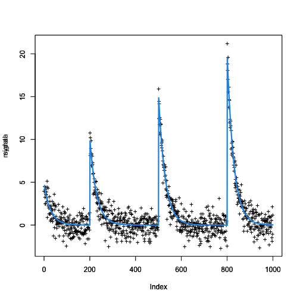

<a id="top"></a>

[](https://travis-ci.com/vrunge/gfpop)
[](https://github.com/vrunge/gfpop)

<!-- 
%\VignetteEngine{knitr::rmarkdown} 
%\VignetteIndexEntry{An Introduction to gfpop}
--> 

# gfpop Vignette
### Vincent Runge
#### LaMME, Evry University
### March 2, 2022

> [Quick Start](#qs)

> [Some examples](#se)

> [Graph construction](#gc)

> [Supplementary R functions](#suppl)


## Quick Start

we present a basic use of the main functions of the `gfpop` package. More details about optional arguments are given in later sections.

We install the package from Github:


```r
#devtools::install_github("vrunge/gfpop")
library(gfpop)
```

We simulate some univariate gaussian data (`n = 1000` points) with relative change-point positions `0.1, 0.3, 0.5, 0.8, 1` and means `1, 2, 1, 3, 1` with a variance equal to `1`.


```r
n <- 1000
myData <- dataGenerator(n, c(0.1,0.3,0.5,0.8,1), c(1,2,1,3,1), sigma = 1)
```

We define the graph of constraints to use for the dynamic programming algorithm. A simple case is the up-down constraint with a penalty here equal to a classic `2 log(n)`.


```r
myGraph <- graph(penalty = 2*log(n), type = "updown")
```

The gfpop function gives the result of the segmentation using `myData` and `myGraph` as parameters. We choose a gaussian cost.


```r
gfpop(data = myData, mygraph = myGraph, type = "mean")
```

```
## $changepoints
## [1]  100  301  500  803 1000
## 
## $states
## [1] "Dw" "Up" "Dw" "Up" "Dw"
## 
## $forced
## [1] FALSE FALSE FALSE FALSE
## 
## $parameters
## [1] 1.0521929 1.8369729 0.9596474 3.0272542 0.8839396
## 
## $globalCost
## [1] 998.0868
## 
## attr(,"class")
## [1] "gfpop" "mean"
```

The vector `changepoints` gives the last index of each segment. It always ends with the length of the vector `vectData`.

The vector `states` contains the states in which lies each mean. The length of this vector is the same as the length of `changepoint`.

The vector `forced` is a boolean vector. A forced element means that two consecutive means have been forced to satisfy the constraint. For example, the "up" edge with parameter c is forced if m(i+1) - m(i) = c.

The vector `parameters` contains the inferred means/parameters of the successive segments. 
 
The number `globalCost` is equal to the non-penalized cost, that is the value of the fit to the data ignoring the penalties for adding changes.

<a id="se"></a>

## Some examples

### Isotonic regression

The isotonic regression infers a sequence of nondecreasing means. 


```r
n <- 1000
mydata <- dataGenerator(n, c(0.1, 0.2, 0.3, 0.4, 0.6, 0.8, 1), c(0, 0.5, 1, 1.5, 2, 2.5, 3), sigma = 1)
myGraphIso <- graph(penalty = 2*log(n), type = "isotonic")
gfpop(data =  mydata, mygraph = myGraphIso, type = "mean")
```

```
## $changepoints
## [1]  175  353  606  810 1000
## 
## $states
## [1] "Iso" "Iso" "Iso" "Iso" "Iso"
## 
## $forced
## [1] FALSE FALSE FALSE FALSE
## 
## $parameters
## [1] 0.3007753 1.0935178 1.9430410 2.5804569 3.0192673
## 
## $globalCost
## [1] 933.5254
## 
## attr(,"class")
## [1] "gfpop" "mean"
```

In this example, we use in `gfpop` function a robust biweight gaussian cost with `K = 1` and the `min` parameter in order to infer means greater than `0.5`.

### Fixed number of change-points

This algorithm is called segment neighborhood in the change-point litterature. In this example, we fixed the number of segments at 3 with an isotonic constraint. The graph contains two "up" edges with no cycling.


```r
n <- 1000
mydata <- dataGenerator(n, c(0.1, 0.2, 0.3, 0.4, 0.6, 0.8, 1), c(0, 0.5, 1, 1.5, 2, 2.5, 3), sigma = 1)
beta <- 0
myGraph <- graph(
  Edge(0, 1,"up", beta),
  Edge(1, 2, "up", beta),
  Edge(0, 0, "null"),
  Edge(1, 1, "null"),
  Edge(2, 2, "null"),
  StartEnd(start = 0, end = 2))

gfpop(data =  mydata, mygraph = myGraph, type = "mean")
```

```
## $changepoints
## [1]  304  797 1000
## 
## $states
## [1] "0" "1" "2"
## 
## $forced
## [1] FALSE FALSE
## 
## $parameters
## [1] 0.5015381 2.1475851 3.0267732
## 
## $globalCost
## [1] 1046.291
## 
## attr(,"class")
## [1] "gfpop" "mean"
```

### Robust up-down with constrained starting and ending states

In presence of outliers we need a robust loss (biweight). We can also force the starting and ending state and a minimal gap between the means (here equal to `1`)


```r
n <- 1000
chgtpt <- c(0.1, 0.3, 0.5, 0.8, 1)
myData <- dataGenerator(n, chgtpt, c(0, 1, 0, 1, 0), sigma = 1)
myData <- myData + 5 * rbinom(n, 1, 0.05) - 5 * rbinom(n, 1, 0.05)
beta <- 2 * log(n)
myGraph <- graph(
         Edge("Dw", "Up", type = "up", penalty = beta, gap = 1, K = 3),
         Edge("Up", "Dw", type = "down", penalty = beta, gap = 1, K = 3),
         Edge("Dw", "Dw", type = "null", K = 3),
         Edge("Up", "Up", type = "null", K = 3),
         StartEnd(start = "Dw", end = "Dw"))
gfpop(data =  myData, mygraph = myGraph, type = "mean")
```

```
## $changepoints
## [1]  108  309  498  802 1000
## 
## $states
## [1] "Dw" "Up" "Dw" "Up" "Dw"
## 
## $forced
## [1]  TRUE FALSE  TRUE  TRUE
## 
## $parameters
## [1] -0.01193667  0.98806333 -0.03766739  0.96233261 -0.03766739
## 
## $globalCost
## [1] 1067.88
## 
## attr(,"class")
## [1] "gfpop" "mean"
```

If we skip all these constraints and use a standard fpop algorithm, the result is the following


```r
myGraphStd <- graph(penalty = 2*log(n), type = "std")
gfpop(data =  myData, mygraph = myGraphStd, type = "mean")
```

```
## $changepoints
##  [1]    2    8    9   20   21   48   49   92   94   98  108  109  149  150  171
## [16]  172  191  192  206  207  257  259  260  261  305  306  307  312  314  329
## [31]  330  398  406  431  432  452  453  458  462  475  476  494  495  536  537
## [46]  541  543  544  552  553  558  559  568  570  592  593  619  620  625  626
## [61]  695  696  727  728  734  735  756  757  774  775  779  782  784  810  813
## [76]  823  831  852  853  854  857  858  859  895  896  935  936  993  994 1000
## 
## $states
##  [1] "Std" "Std" "Std" "Std" "Std" "Std" "Std" "Std" "Std" "Std" "Std" "Std" "Std"
## [14] "Std" "Std" "Std" "Std" "Std" "Std" "Std" "Std" "Std" "Std" "Std" "Std" "Std"
## [27] "Std" "Std" "Std" "Std" "Std" "Std" "Std" "Std" "Std" "Std" "Std" "Std" "Std"
## [40] "Std" "Std" "Std" "Std" "Std" "Std" "Std" "Std" "Std" "Std" "Std" "Std" "Std"
## [53] "Std" "Std" "Std" "Std" "Std" "Std" "Std" "Std" "Std" "Std" "Std" "Std" "Std"
## [66] "Std" "Std" "Std" "Std" "Std" "Std" "Std" "Std" "Std" "Std" "Std" "Std" "Std"
## [79] "Std" "Std" "Std" "Std" "Std" "Std" "Std" "Std" "Std" "Std" "Std" "Std"
## 
## $forced
##  [1] FALSE FALSE FALSE FALSE FALSE FALSE FALSE FALSE FALSE FALSE FALSE FALSE FALSE
## [14] FALSE FALSE FALSE FALSE FALSE FALSE FALSE FALSE FALSE FALSE FALSE FALSE FALSE
## [27] FALSE FALSE FALSE FALSE FALSE FALSE FALSE FALSE FALSE FALSE FALSE FALSE FALSE
## [40] FALSE FALSE FALSE FALSE FALSE FALSE FALSE FALSE FALSE FALSE FALSE FALSE FALSE
## [53] FALSE FALSE FALSE FALSE FALSE FALSE FALSE FALSE FALSE FALSE FALSE FALSE FALSE
## [66] FALSE FALSE FALSE FALSE FALSE FALSE FALSE FALSE FALSE FALSE FALSE FALSE FALSE
## [79] FALSE FALSE FALSE FALSE FALSE FALSE FALSE FALSE FALSE FALSE FALSE
## 
## $parameters
##  [1]  1.36279545 -1.74339905  5.34554026  0.50520284 -6.37290639  0.20723008
##  [7]  4.50917300 -0.43925974  4.63956377 -3.53360841  0.04296051 -4.06154149
## [13]  1.07936761  6.29813959  0.82735263  6.86349288  0.75747821  6.88785100
## [19]  1.19814260  7.20841439  0.60564366 -3.75320657  0.89107584  6.57828607
## [25]  1.14664991 -3.80474528  4.94246032 -0.18602209 -6.07397662 -0.48329887
## [31] -7.46945073  0.42058923 -2.22988971  0.25357573  5.59869925 -0.18537678
## [37]  6.25833253 -0.61726582  2.45138777 -0.54037567 -7.44798015  0.10966744
## [43] -4.67110127  0.87643562  7.53403854  1.35543649 -2.63053575  6.31122270
## [49]  0.64112734 -5.65952409  0.40526204 -6.50814952  0.99806285 -3.26024489
## [55]  0.64232718 -4.74557440  1.32881979  5.48998766 -0.33028505  6.12547441
## [61]  0.72813543 -5.11065887  0.61758417  6.06059329  0.73494335 -5.40902777
## [67]  0.54970868 -4.89871230  0.78192206  6.63650093  1.99403210 -2.48950878
## [73]  4.86845490  0.42877928 -3.54515124  0.27709739 -2.09998172  0.03829753
## [79] -4.63676873  5.85591421  0.97536242 -4.17660677  6.18037733  0.05789482
## [85]  5.66238275  0.22079251 -5.12646353  0.19913805 -7.53428934  0.32529376
## 
## $globalCost
## [1] 1531.253
## 
## attr(,"class")
## [1] "gfpop" "mean"
```

### abs edge

With a unique `"abs"` edge, we impose a difference between the means of size at least 1.  


```r
n <- 10000
myData <- dataGenerator(n, c(0.1, 0.2, 0.3, 0.4, 0.5, 0.6, 0.7, 0.8, 0.9, 1), c(0, 1, 0, 2, 1, 2, 0, 1, 0, 1), sigma = 0.5)
beta <- 2*log(n)
myGraph <- graph(
  Edge(0, 0,"abs", penalty = beta, gap = 1),
  Edge(0, 0,"null"))
gfpop(data =  myData, mygraph = myGraph, type = "mean")
```

```
## $changepoints
##  [1]  1000  2001  3000  4001  5001  6000  7002  7998  9000 10000
## 
## $states
##  [1] "0" "0" "0" "0" "0" "0" "0" "0" "0" "0"
## 
## $forced
## [1]  TRUE  TRUE FALSE  TRUE FALSE FALSE FALSE FALSE FALSE
## 
## $parameters
##  [1] 0.0148537593 1.0148537593 0.0148537593 2.0048952752 1.0048952752 2.0059944122
##  [7] 0.0092369785 1.0232259852 0.0008577806 1.0364847358
## 
## $globalCost
## [1] 2548.417
## 
## attr(,"class")
## [1] "gfpop" "mean"
```

Notice that some of the edges are forced, the vector `forced` contains non-zero values.


### Exponential decay

The null edge corresponds to an exponential decay state if its parameter is not equal to 1. 


```r
n <- 1000
mydata <- dataGenerator(n, c(0.2, 0.5, 0.8, 1), c(5, 10, 15, 20), sigma = 1, gamma = 0.966)
beta <- 2*log(n)
myGraphDecay <- graph(
  Edge(0, 0, "up", penalty = beta),
  Edge(0, 0, "null", 0, decay = 0.966)
  )
g <- gfpop(data =  mydata, mygraph = myGraphDecay, type = "mean")
g
```

```
## $changepoints
## [1]  200  500  800 1000
## 
## $states
## [1] "0" "0" "0" "0"
## 
## $forced
## [1] FALSE FALSE FALSE
## 
## $parameters
## [1] 0.0046031590 0.0003127344 0.0004575298 0.0192687263
## 
## $globalCost
## [1] 955.8429
## 
## attr(,"class")
## [1] "gfpop" "mean"
```


and we plot the result 


```r
gamma <- 0.966
len <- diff(c(0, g$changepoints))
signal <- NULL
for(i in length(len):1)
  {signal <- c(signal, g$parameters[i]*c(1, cumprod(rep(1/gamma,len[i]-1))))}
signal <- rev(signal)

ylimits <- c(min(mydata), max(mydata))
plot(mydata, type ='p', pch ='+', ylim = ylimits)
par(new = TRUE)
plot(signal, type ='l', col = 4, ylim = ylimits, lwd = 3)
```




<a id="gc"></a>

## Graph construction

In the `gfpop` package, graphs are represented by a dataframe with 9 features and build with the R functions `Edge`, `Node`, `StartEnd` and `graph`.


```r
emptyGraph <- graph()
emptyGraph
```

```
## [1] state1    state2    type      parameter penalty   K         a        
## [8] min       max      
## <0 lignes> (ou 'row.names' de longueur nulle)
```


`state1` is the starting node of an edge, `state2` its ending node. `type` is one of the available edge type (`"null"`, `"std"`, `"up"`, `"down"`, `"abs"`). `penalty` is a nonnegative parameter: the additional cost $\beta_i$ to consider when we move within the graph using a edge (or stay on the same node). `parameter` is annother nonnegative parameter, a characteristics of the edge, depending of its type (it is a decay if type is "null" and a gap otherwise). `K` and `a` are robust parameters. `min` and `max` are used to constrain the rang of value for the node parameter.

We add edges into a graph as follows


```r
myGraph <- graph(
  Edge("E1", "E1", "null"),
  Edge("E1", "E2", "down", 3.1415, gap = 1.5)
)
myGraph
```

```
##   state1 state2 type parameter penalty   K a min max
## 1     E1     E1 null       1.0       0 Inf 0  NA  NA
## 2     E1     E2 down       1.5       0 Inf 0  NA  NA
```

we can only add edges to this dataframe using the object `Edge`.

The graph can contain information on the starting and/or ending edge to use with the `StartEnd` function. 


```r
beta <- 2 * log(1000)
myGraph <- graph(
  Edge("Dw", "Dw", "null"),
  Edge("Up", "Up", "null"),
  Edge("Dw", "Up", "up", penalty = beta, gap = 1),
  Edge("Dw", "Dw", "down", penalty = beta),
  Edge("Up", "Dw", "down", penalty = beta),
  StartEnd(start = "Dw", end = "Dw"))
myGraph
```

```
##   state1 state2  type parameter  penalty   K  a min max
## 1     Dw     Dw  null         1  0.00000 Inf  0  NA  NA
## 2     Up     Up  null         1  0.00000 Inf  0  NA  NA
## 3     Dw     Up    up         1 13.81551 Inf  0  NA  NA
## 4     Dw     Dw  down         0 13.81551 Inf  0  NA  NA
## 5     Up     Dw  down         0 13.81551 Inf  0  NA  NA
## 6     Dw   <NA> start        NA       NA  NA NA  NA  NA
## 7     Dw   <NA>   end        NA       NA  NA NA  NA  NA
```


Some graphs are often used: they are defined by default in the `graph` function. To use these graphs, we specify a string `type` equal to `"std"`, `"isotonic"`, `"updown"` or `"relevant"`.
For example,


```r
myGraphIso <- graph(penalty = 12, type = "isotonic")
myGraphIso
```

```
##   state1 state2 type parameter penalty   K a min max
## 1    Iso    Iso null         1       0 Inf 0  NA  NA
## 2    Iso    Iso   up         0      12 Inf 0  NA  NA
```

The function `Node` can be used to restrict the range of value for parameter associated to a node (called also a vertex). For example the following graph is an isotonic graph with inferred parameters between 0 et 1 only.


```r
myGraph <- graph(
  Edge("Up", "Up", "up", penalty = 3.1415),
  Edge("Up", "Up"),
  Node("Up", min = 0, max = 1)
  )
myGraph
```

```
##   state1 state2 type parameter penalty   K  a min max
## 1     Up     Up   up         0  3.1415 Inf  0  NA  NA
## 2     Up     Up null         1  0.0000 Inf  0  NA  NA
## 3     Up     Up node        NA      NA  NA NA   0   1
```

<a id="suppl"></a>

## Supplementary R functions

### Data generator function

the `dataGenerator` function is used to simulate `n` data-points from a distribution of `type` equal to `"mean"`, `"poisson"`, `"exp"`, `"variance"` or `"negbin"`. Standard deviation parameter `sigma` and decay `gamma` are specific to the Gaussian mean model. `size` is linked to the R `rnbinom` function from R stats package.

### Standard deviation estimation

We often need to estimate the standard deviation from the observed data to normalize the data or choose the edge penalties. The `sdDiff` returns such an estimation with the default HALL method [Hall et al., 1990] well suited for time series with change-points.


[Back to Top](#top)

